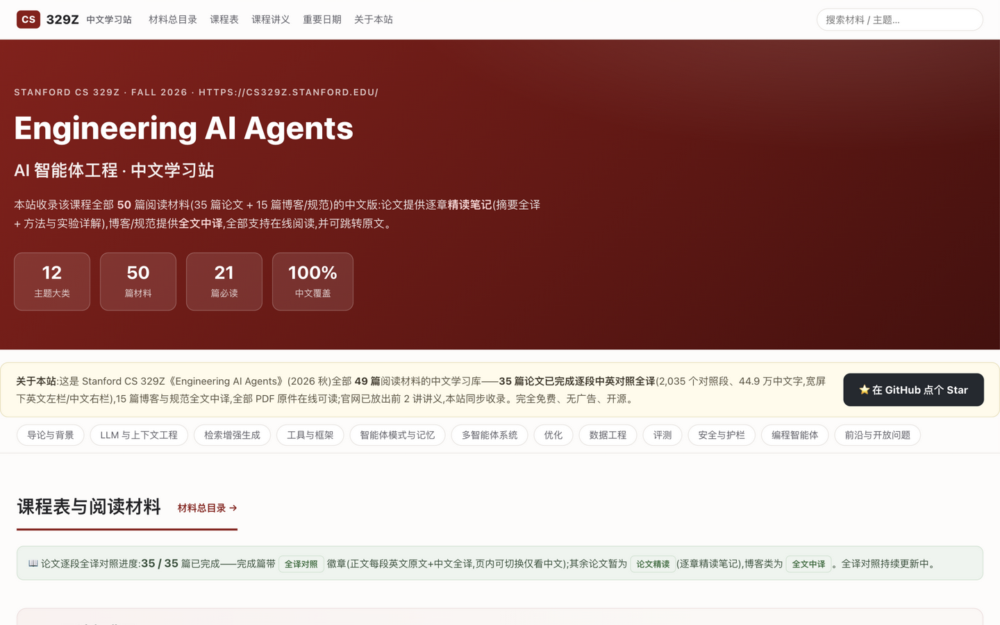
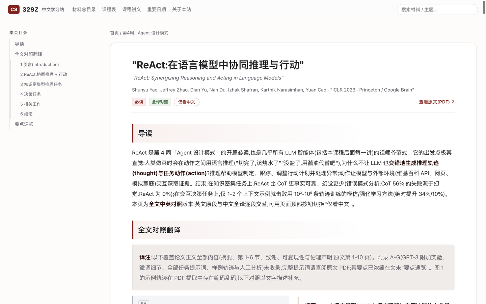
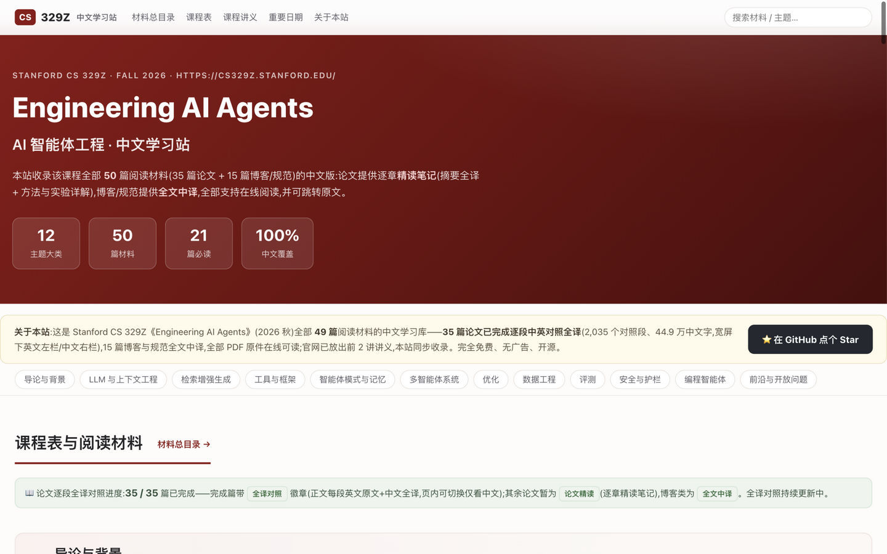

<div align="center">

# Stanford CS 329Z · Engineering AI Agents 中文学习站

**斯坦福 2026 秋季《AI 智能体工程》课程 · 全部阅读材料逐段中英对照全译**

[](https://github.com/athlonk8/cs329z/actions/workflows/pages.yml)
[](https://cs.xuyili.com)
[](LICENSE)
[](CONTRIBUTING.md)

**[📖 在线阅读 cs.xuyili.com](https://cs.xuyili.com)** · [课程官网](https://cs329z.stanford.edu/) · [材料总目录](https://cs.xuyili.com/materials.html) · [更新日志](#-更新日志)

</div>

---

## 这是什么

**Stanford CS 329Z《Engineering AI Agents》** 是斯坦福 2026 年秋季开设的研究生课程(授课:Diyi Yang、Michael Ryan 等,Stanford NLP Group),从 ReAct、RAG、MCP、记忆系统、多智能体,一路讲到测试时计算、数据工程、评测、安全与编程智能体——恰好是当前 AI 工程方向最抢手的一套能力栈,开课消息公布后在社区引发了大量关注。

本仓库是这个课程的**非官方中文学习站**:把课程公开的全部阅读材料翻译成中文,做成可在线阅读的静态网站,**完全免费、无广告、无追踪**。

| 收录内容 | 数量 | 形式 |
|---|---|---|
| 课程必读/推荐论文 | **35 篇全部完成逐段中英对照全译** | 每段英文原文 + 中文全译左右分栏,共 **2,035** 个对照段、约 **45 万** 中文字 |
| 工程博客 / 规范文档 | 14 篇 | 全文中译(含 MCP 规范、Anthropic 工程博客等) |
| 背景解读 | 1 篇 | 全文中译(CS329A 免费公开课程背景长文) |
| 课程讲义 slides | 持续同步 | 官网每放出一讲即收录 PDF 原件(已收录 Lecture 1–2) |
| PDF / HTML 原件 | 49 篇全部收录 | `originals/` 目录,在线可读 |

> 35 篇论文的**全文逐段对照**全部完成——不是摘要式"精读笔记",是从 Abstract 到 Conclusion(多数含实质附录)的完整翻译,参考文献列表保留原文。

## 网站长什么样

<p align="center">
  
</p>

<p align="center">
  
  
</p>

- **左右对照** —— 宽屏(≥1240px)下每段英文原文居左、中文全译居右;一键切换"仅看中文"
- **公式排版** —— 本地 KaTeX 渲染全部 LaTeX 公式,零外部依赖
- **主题导航** —— 49 篇材料按 12 个主题大类归类,支持按类型/重要度筛选、全文搜索
- **重要度徽章** —— 必读 / 推荐 / 补充(编者依据课程大纲判断)
- **讲义同步** —— 官网放出的 Lecture slides 同步收录,PDF 直连无需科学上网访问 Google Drive

## 快速开始

**在线阅读(推荐)**:<https://cs.xuyili.com>

**本地构建**(纯 Python,仅依赖一个库):

```bash
git clone https://github.com/athlonk8/cs329z.git
cd cs329z/source
pip install -r ../requirements.txt   # 只有 markdown 一个依赖
python3 build.py                     # 构建完整站点到 source/site/
python3 -m http.server -d site 8329  # 打开 http://127.0.0.1:8329
```

仓库根目录本身就是**已构建好的站点**(GitHub Pages 直接部署它),`source/` 是它的完整源码——fresh clone 开箱即可构建。

## 项目结构

```
.
├── index.html / materials.html   # 已构建站点(GitHub Pages 部署的就是仓库根目录)
├── reading/                      # 50 个阅读页面(HTML)
├── originals/                    # 课程官方 49 篇 PDF/HTML 原件(约 150MB)
├── slides/                       # 官网放出的课程讲义 PDF(随课程进度同步)
├── assets/                       # 样式 / 脚本 / 搜索索引 / 本地 KaTeX
├── source/                       # ★ 全部源码
│   ├── build.py                  #   静态站点生成器(纯 Python + markdown 库,无框架)
│   ├── content/                  #   全部译文 Markdown
│   │   ├── bilingual/            #     35 篇论文的全译对照源(::: en 块 + 中文段落)
│   │   └── extras/               #     背景阅读
│   ├── assets/                   #   style.css / site.js / KaTeX 本地副本
│   └── extracted/manifest.json   #   材料清单元数据(标题/作者/讲次/分类)
├── docs/screenshots/             # README 用截图
└── .github/                      # Pages 自动部署工作流 + Issue/PR 模板
```

**全译对照的源文件格式**(`source/content/bilingual/*.md`):

```markdown
---
title: ReAct: Synergizing Reasoning and Acting in Language Models
title_zh: ReAct:在语言模型中协同推理与行动
...

::: en
We introduce ReAct, a new paradigm that...
:::

我们提出 ReAct——一种……的新范式……
```

`build.py` 把每个 `::: en` 块与紧随的中文段落配对渲染成左右分栏;`$$…$$` 公式经占位符保护后交给 KaTeX。详见 [CONTRIBUTING.md](CONTRIBUTING.md)。

## 内容时效与同步策略

- 阅读材料下载于 **2026-09-14**(开课前),覆盖课程大纲公布的全部 49 篇
- 课程 **9/23 开课**,官网随进度放出讲义 → 本站同步收录(现为 Lecture 1–2)
- **HW1 将于 10/5 发布**、HW2 于 10/26 发布,公开后跟进收录
- 课程**视频暂未公开**(仅斯坦福内部 Canvas);姊妹课 CS329A 的全部讲次曾于学期后上传 [Stanford Online YouTube](https://www.youtube.com/@stanfordonline),CS329Z 大概率沿用此路径,值得持续关注

## 如何贡献

- 🐛 **发现错译/建议** —— 直接 [提 Issue](https://github.com/athlonk8/cs329z/issues/new/choose)(有现成模板,填链接和修改建议即可)
- ✏️ **修改译文** —— 编辑 `source/content/` 下对应 Markdown,欢迎 PR,流程见 [CONTRIBUTING.md](CONTRIBUTING.md)
- ⭐ **点亮 Star** —— 让更多需要的人看到它,是对几十万字翻译工作最好的肯定

## 版权与许可

- **本仓库代码**(站点生成器、样式、脚本)以 [MIT License](LICENSE) 开源
- **原文版权归原作者及机构所有**;译文为 AI 辅助 + 人工校对,仅供个人学习研究使用,请勿商用
- 讲义 slides 版权归 Stanford 所有,本站镜像仅为便于国内访问;如有异议请联系删除
- 本项目与 Stanford University 无隶属关系,为爱好者自发维护的学习资源

## 📅 更新日志

| 日期 | 内容 |
|---|---|
| 2026-09-29 | 新增「课程讲义」板块,同步收录 Lecture 1–2 slides;仓库完整化:源码入仓、README/LICENSE/CI/贡献指南 |
| 2026-09-28 | 🎉 35/35 论文逐段全译对照全部完成(2,035 对照段) |
| 2026-09-26 | 宽屏改版;新增 12 主题大类目录与材料总目录筛选;KaTeX 公式渲染 |
| 2026-09-21 | 上线 GitHub Pages,绑定自定义域名 cs.xuyili.com |
| 2026-09-14 | 抓取课程全部 49 篇材料,确定翻译体例,项目启动 |

---

<details>
<summary><b>English TL;DR</b></summary>

Unofficial Chinese study site for Stanford CS 329Z *Engineering AI Agents* (Fall 2026). All 49 course reading materials translated into Chinese: **35 papers fully translated paragraph-by-paragraph with side-by-side English/Chinese alignment** (2,035 aligned pairs), 14 blogs/specs fully translated, plus lecture slides mirrored as they are released. Zero-dependency Python static site generator. Live at **https://cs.xuyili.com**. Original content belongs to its authors; translations are for personal study only.

</details>
